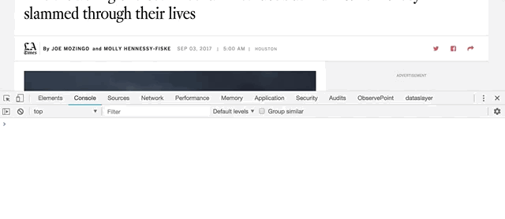

# `trackDom` Click tracking demo

In some cases, the `@trackJs` decorator can't be used to decorate click tracking. In these cases, you can set up click tracking by seeding the DOM with data attributes that `trackDom` can hook into and fire off your analytics callback. 

### STEP 1 - try it out
- Run `yarn demo` and visit http://localhost:3000/track-click/?disable-adloader&disable-oopadloader
- Open the dev tools console. Then, start clicking some things

**App Bar**  


**Social Share**  



### STEP 2 - check out the code

For this demo, we're using a static HTML file with no React, to mimic a Classic PB page. Check out `demo/code/index.html`. You'll see a number of HTML elements with a `data-arctrack` attribute. For example, line 94.

```html
<button ... data-arctrack="topicsOpen" data-role="open-tray" data-tray="topics">
  <span class="fa fa-2x icon-light fa-newspaper-o" aria-hidden="true"></span> 
  <span class="spaced spaced-sm spaced-left hidden-mobile">Topics</span>
</button>
```
And line 643:
```html
<span ... data-arctrack="socialShareTwtr" data-referrer="" target="_blank" rel="noopener noreferrer">
```
This is what's meant by "seeding" the DOM: adding data attributes to your markup that will act as flags for `trackDom` to use later.

Look at `demo/code/click/index.js` to see this example `trackDom` implementation.

**NOTE**: The demo analytics file that uses `Arctrack` is loaded as a script in `index.html`, but you can just as easily add the code to your main bundle file.